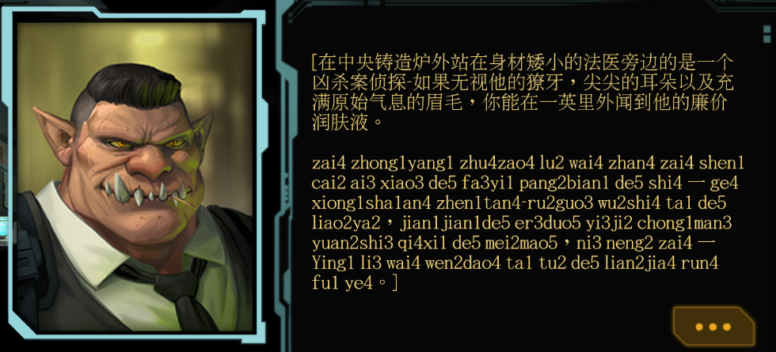

# shadowrunreturns_modified
A repo for the code that I am using to manipulate the various of translations of shadowrun for language learning purposes

To change the PO file to a MO file, run msgfmt test.po -o deadmanswitch.mo
This is the last step after running this software
